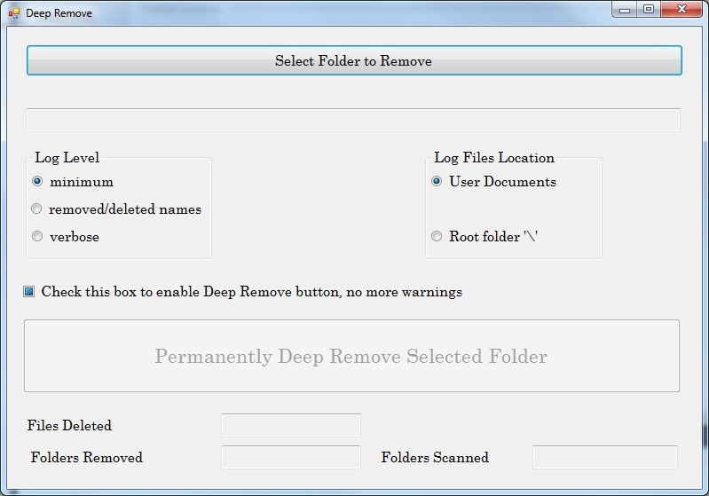

# DeepRemove

Removes folder or directory structures that are too deep 
to remove by traditional tools or shell commands in Windows.

Written in C# with calls into Kernel32.

This tool will help you to remove nested folder structures that
seem infinitively deep.

The only requirement is that you must be the owner of the entire
structure, in order to succesfully remove all folders.
If you are unsure about owning the entire structure;
then, take ownership of the root folder using any of the following
guides:

- How to take ownership of a file or a folder in Windows XP 
  - http://support.microsoft.com/kb/308421
- Quick Tip: Take ownership of files and folders in Windows
  - http://www.techrepublic.com/blog/window-on-windows/quick-tip-take-ownership-of-files-and-folders-in-windows/3688

In some really deep folder structures,
you might need to run the application more than once.
My worst case was deleting a 230 GB restore,
made with robocopy,
where I needed to run the app 4 times 
(actually the app was run once; the button had to be pressed 4 times).

Best regards,

JuanPablo
Last edited Jul 5 at 12:08 PM by JPJofre, version 8